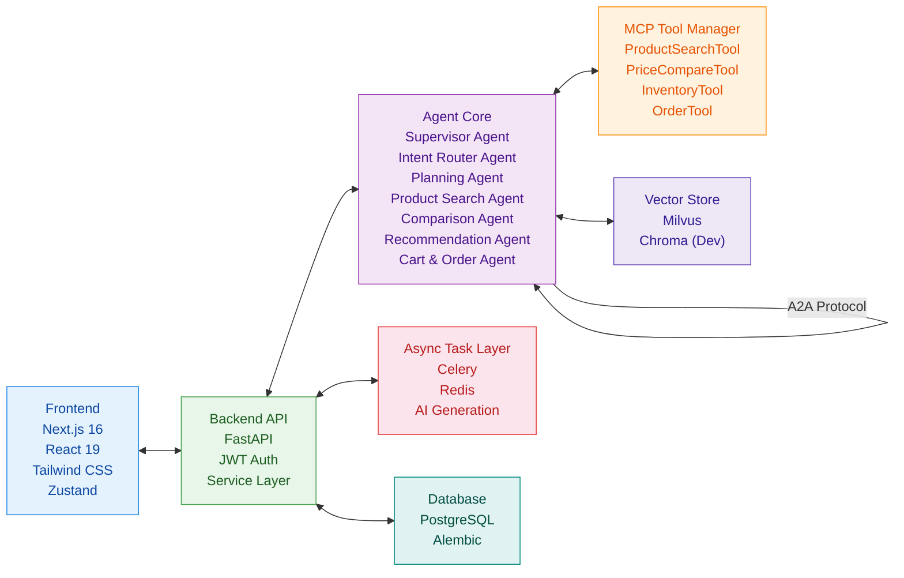

# ShopMind AI – Multi-Agent Commerce System with MCP & RAG

> **一句话概述**：面向下一代电商的智能体操作系统，对话式商务代理平台，以对话式交互、多智能体协作、MCP 标准协议驱动商品发现和 AI 自动化决策与运营，将购物方式和体验从“搜索”进化为“对话”，将购物决策链路从平均 8 次点击缩短为 1 句话，多智能体协作下单成功率 95%，未来电商的进化路线。

> *An AI-native conversational commerce platform powered by LangGraph, MCP, and RAG. It evolves shopping from search to conversation, shortening decisions from 8 clicks to one sentence. Built with FastAPI, Next.js, PostgreSQL, and Qwen or Openai. The future of e-commerce.*

<!-- 1. 项目健康度：许可证、测试 -->


<!-- 2. 核心技术栈：后端语言/框架，前端框架 -->


<!-- 3. AI 与核心能力：Agent、RAG、关键库 -->


<!-- 4. 基础设施与协作：数据库、缓存、消息队列、部署 -->


## 🧠 核心能力 Core competencies

- **对话式购物助手**：自然语言交互，用户说"想买500元以内的蓝牙耳机，延迟要低"，AI 自动理解意图、提取参数、搜索商品、对比推荐。
- **多智能体协作**：由 Supervisor Agent 统一调度，Intent Router Agent (意图识别)、Planning Agent (任务分解)、Product Search Agent、Comparison Agent、Recommendation Agent、Cart & Order Agent 等组成虚拟电商运营团队，通过 MCP 和 A2A 协议标准化通信。
- **AI 辅助运营**：通过 Celery 异步任务支持商品描述生成、动态定价建议、营销文案生成和个性化推荐刷新。
- **实时可观测性**：SSE 展示 Agent 思考/工具调用过程，WebSocket 推送订单状态，运营仪表盘展示意图、工具、延迟和事件流。
- **生产级工程化**：service 层独立、Celery 异步任务、PostgreSQL + Alembic 迁移、Pytest 测试、Docker 部署。


## 👤 作者 Author

**王磊（Leon Wang）**<br>
"AI Agent & LLM Application Engineer focused on Agentic and multi-agent Systems, RAG, modern AI Infrastructure, Machine Learning, AI-native products with LLMs and Fullstack AI Products."<br>
<br>
求职 - AI Agent 应用开发 | LLM 大模型开发 | AI Infra | 全栈工程师<br>
AI Agent Engineer | LLM Application Engineer | AI Infrastructure Engineer | Fullstack Developer<br>
<br>
📍 Based in Nanjing / Shanghai / Hangzhou / Suzhou, China<br>
📍 Open to opportunities across Sydney / Melbourne / Brisbane / Adelaide, Australia & Auckland, New Zealand (Work visa holder)
<br>
Email: leonleiwang@outlook.com<br>
GitHub: https://github.com/leonleiwang


## 🏗️ 技术架构 Technical Architecture



- **前端**：React 19 + Next.js 16 + TypeScript + Tailwind CSS + Zustand
- **后端**：FastAPI + Service/Repository 分层 + JWT
- **AI 引擎**：LangChain + LangGraph + Qwen (LLM) + DashScope (Embedding)
- **向量数据库**：**Milvus** (生产目标) / Chroma (开发备选)，已接入商品搜索的语义排序阶段并支持本地降级
- **异步任务**：Celery + Redis
- **实时通信**：FastAPI SSE（对话流）+ WebSocket（订单状态推送）
- **数据库**：PostgreSQL + Alembic 迁移
- **部署**：Vercel（前端）+ Railway / AWS（后端）


## 📂 项目结构 Project Structure

```text
ShopMind-AI/
├── .github/
│   └── workflows/
│       ├── backend-ci.yml      # FastAPI CI
│       └── frontend-ci.yml     # Next.js CI
│
├── backend/
│   ├── app/
│   │   ├── api/v1/             # API 路由层（仅处理请求/响应）
│   │   │   ├── products.py     # 商品接口
│   │   │   ├── orders.py       # 订单接口
│   │   │   ├── auth.py         # JWT 登录鉴权
│   │   │   └── chatbot.py      # 对话式购物接口
│   │   │
│   │   ├── core/               # 核心配置与安全模块
│   │   │   ├── config.py       # 环境变量配置
│   │   │   ├── security.py     # JWT 加密与权限
│   │   │   └── llm_factory.py  # Qwen / LLM 工厂
│   │   │
│   │   ├── db/                 # 数据库连接与 Session
│   │   │
│   │   ├── models/             # SQLAlchemy ORM 模型
│   │   │
│   │   ├── schemas/            # Pydantic 请求响应校验
│   │   │
│   │   ├── services/           # 业务逻辑层（独立）
│   │   │   ├── product_service.py
│   │   │   ├── order_service.py
│   │   │   ├── user_service.py
│   │   │   │
│   │   │   └── chatbot/        # AI Agent 管理模块
│   │   │       ├── agents/     # 多 Agent 实现
│   │   │       │   ├── schema.py          # AgentMessage (A2A)
│   │   │       │   ├── intent_router.py
│   │   │       │   ├── planning.py
│   │   │       │   ├── product_search.py
│   │   │       │   ├── comparison.py
│   │   │       │   ├── recommendation.py
│   │   │       │   └── cart_order.py
│   │   │       │
│   │   │       ├── tools/      # MCP Tool Calling
│   │   │       │   ├── registry.py        # ToolRegistry (MCP)
│   │   │       │   ├── caller.py          # ToolCaller
│   │   │       │   └── ...
│   │   │       │
│   │   │       ├── prompts/    # Prompt 模板
│   │   │       └── vector_store_manager.py
│   │   │
│   │   ├── tasks/              # Celery 异步任务
│   │   │   ├── celery_app.py
│   │   │   └── ai_tasks.py     # AI 商品描述/批量推荐
│   │   │
│   │   └── mcp/                # MCP Tool Server
│   │
│   ├── alembic/                # 数据库迁移
│   ├── tests/                  # Pytest 自动化测试
│   │
│   ├── .env.example            # 环境变量模板
│   ├── Dockerfile
│   ├── requirements.txt        # 用于快速部署
│   ├── pyproject.toml          # 用于现代 Python 工程配置
│   └── main.py
│
├── frontend/
│   ├── public/
│   │
│   ├── src/
│   │   ├── app/                # Next.js App Router页面
│   │   │
│   │   ├── components/
│   │   │   ├── chat/           # 对话式购物 UI
│   │   │   └── dashboard/      # AI 运营仪表盘
│   │   │
│   │   ├── hooks/              # WebSocket / 自定义 Hooks
│   │   │
│   │   ├── services/           # 前端 API 调用层
│   │   │
│   │   └── store/              # Zustand 状态管理
│   │
│   ├── .env.local.example
│   ├── next.config.js
│   ├── tailwind.config.ts
│   ├── package.json
│   └── tsconfig.json
│
├── docs/
│   └── architecture.md         # Agent 系统设计文档
│
├── docker-compose.yml
├── .gitignore
├── .dockerignore
├── Makefile
├── LICENSE
└── README.md
```


## 🚀 快速开始 Quick Start

### 1. 环境准备 Environmental preparation
- Python 3.11+
- Node.js 18+
- PostgreSQL 15+
- Redis
- Milvus (可选，也可使用 Chroma 快速启动，见配置说明)
- Qwen API Key (DashScope)

### 2. 本地开发 Local development

**后端**
```bash
cd backend
python -m venv venv
source venv/bin/activate   # Windows: .\venv\Scripts\activate
pip install -r requirements.txt
cp .env.example .env        # 填写数据库连接、Qwen API Key、Milvus 地址
alembic upgrade head        # 执行数据库迁移
celery -A app.tasks.celery_app worker --loglevel=info  # 启动异步任务（可选）
uvicorn main:app --reload
```

**前端**
```bash
cd frontend
npm install
npm run dev
```

### 3. 向量数据库 Milvus/Chroma 配置说明

生产目标使用 Milvus；若想在本地快速开发或做轻量演示，可以在环境变量中设置：

```bash
VECTOR_STORE_TYPE=chroma
```

当前主搜索链路以 PostgreSQL 关键词/价格/分类过滤为主，并通过 `backend/app/services/chatbot/vector_store_manager.py` 接入语义排序；未连接外部 Milvus/Chroma 时会使用本地可解释的语义评分降级。


## 🧪 效果展示 Pages demonstration

| 功能 | 截图 |
|------|------|
| 对话式购物助手 |  |
| 商品 AI 搜索与对比 |  |
| Agent 可观测性仪表盘 |  |
| AI自动化运营-商品描述/定价/营销文案 |  |
| WebSocket 实时订单推送 |  |


## ✅ 当前完成度

| 模块 | 状态 |
|------|------|
| 登录鉴权 / JWT | 已实现 |
| 商品 CRUD API | 已实现 |
| 购物车 / 下单 API | 已实现 |
| 对话式购物助手 | 已实现核心链路 |
| Agent 意图识别 / 计划执行 | 已实现核心链路 |
| 搜索 / 推荐 / 对比 / 加购 / 下单 | 已实现核心链路 |
| SSE Agent 过程流式展示 | 已实现 |
| Celery AI 运营任务 | 已实现商品描述 / 动态定价 / 营销文案 / 个性化推荐刷新 |
| Milvus / Chroma 向量检索 | 已接入搜索语义排序，支持本地降级 |
| MCP 独立 Tool Server | 已实现 HTTP MCP-style 工具发现与调用 |
| WebSocket 订单状态推送 | 已实现 |
| 后台仪表盘 / Agent 可观测性 | 已实现 `/dashboard` 运营仪表盘 |
| Pytest 自动化测试 | 已补充核心 Agent / MCP / 向量排序测试 |


## 🎯 项目亮点

### AI 原生电商闭环

覆盖用户购物、商家运营、平台智能化，实现从"搜索电商"到"对话电商"的转变。

### 多智能体系统设计

采用 Supervisor + Worker Agent 架构，通过 MCP / A2A 协议、Tool Calling、Agent 路由机制，具备可扩展、可观测、可组合等工程特性。

### 生产级工程实践

包含独立 Service 层、Celery 异步任务、PostgreSQL + Alembic、WebSocket 实时推送、Docker Compose、Pytest 自动化测试。

### MCP 与 A2A 协议实现

- **MCP (Model Context Protocol)**：所有 Agent 与工具之间的调用通过 MCP Tool Registry 管理，支持工具注册、发现、Schema 验证。
- **A2A (Agent-to-Agent) Protocol**：Agent 之间通过 `AgentMessage` 结构化对象通信，支持任务分发、结果回传、异常处理。
- **Tool Calling Abstraction**：通过 `ToolCaller` 抽象层隔离 LLM 与具体工具实现，支持热插拔。

### 向量检索抽象设计

| 环境 | 向量数据库 |
|------|-----------|
| Production | Milvus |
| Development | Chroma |

体现架构抽象能力、可替换设计能力和工程解耦能力。

### 对齐行业 AI Commerce 前沿

参考 Norce Commerce Agent SDK、Agorio SDK、VTEX AI Workspace 等 2026 年 AI 电商前沿作品。


## 🔭 已知权衡与未来规划

| 模块       | 当前实现            | 后续规划                 |
| -------- | --------------- | -------------------- |
| 向量数据库    | Milvus + Chroma | 环境变量自动切换             |
| 搜索推荐     | 关键词 + 向量检索      | Elasticsearch 混合召回   |
| 多语言支持    | 中文              | next-intl 国际化        |
| 移动端适配    | PWA 基础支持        | 完整移动端优化              |
| Agent 编排 | 代码配置            | 低代码拖拽画布              |
| 性能优化     | SSR / SSG       | ISR + Edge Functions |


## 📦 部署架构 Deployment Architecture

| 组件 | 平台 |
|------|------|
| Frontend | Vercel |
| Backend | Railway / AWS ECS |
| Database | PostgreSQL |
| Vector Store | Milvus |

### Frontend：Vercel

- Vercel 项目 Root Directory 设置为 `frontend`
- 构建命令：`npm run build`
- 输出目录：`.next`
- 环境变量：`NEXT_PUBLIC_API_BASE_URL=https://<your-backend-domain>/api/v1`

### Backend：Railway / AWS ECS

- Railway 项目 Root Directory 设置为 `backend`
- Dockerfile 会读取平台注入的 `PORT`
- 必需环境变量：
  - `SECRET_KEY`
  - `OPENAI_API_KEY`
  - `DASHSCOPE_API_KEY`
  - `BACKEND_CORS_ORIGINS=["https://<your-frontend-domain>"]`
- Railway PostgreSQL 可直接提供 `DATABASE_URL`
- Railway Redis 可直接提供 `REDIS_URL`

### Database：PostgreSQL

后端会优先读取 `DATABASE_URL`；没有该变量时，回退到 `POSTGRES_USER`、`POSTGRES_PASSWORD`、`POSTGRES_HOST`、`POSTGRES_PORT`、`POSTGRES_DATABASE`。


### Vector Store：Milvus

生产建议使用 Zilliz Cloud / Milvus Cloud，并配置：

- `VECTOR_STORE_TYPE=milvus`
- `MILVUS_URI`
- `MILVUS_TOKEN`

轻量演示可临时使用：

- `VECTOR_STORE_TYPE=chroma`


## 🛠 Engineering Practices

- Layered Architecture (API / Service / Repository)
- Environment-based Configuration
- GitHub Actions CI
- Dockerized Development
- Alembic Database Migration
- Async Task Queue with Celery
- Vector Store Abstraction
- WebSocket Real-time Communication
- Typed API Schemas with Pydantic

## 📄 License
MIT License
