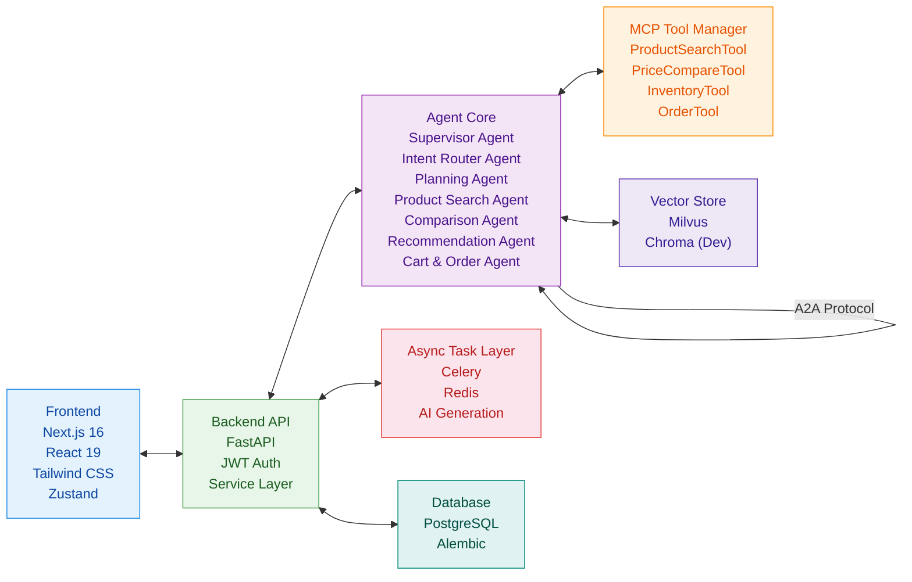
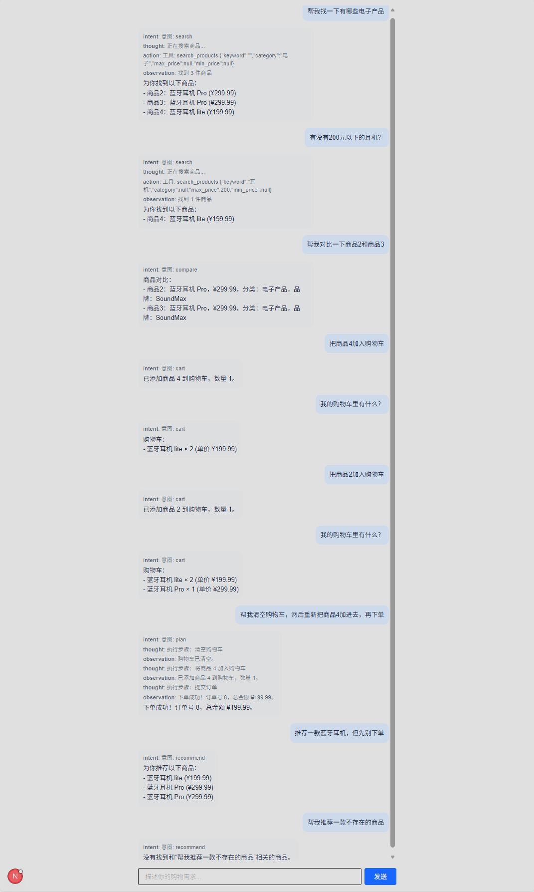
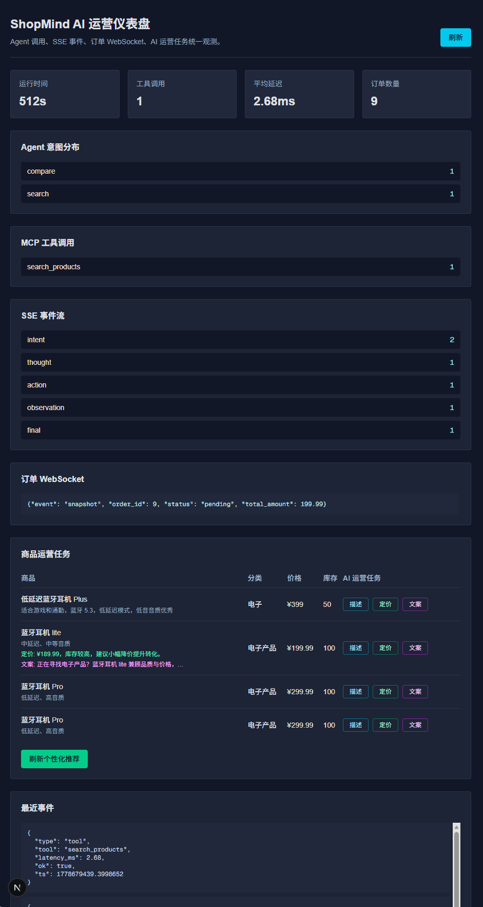
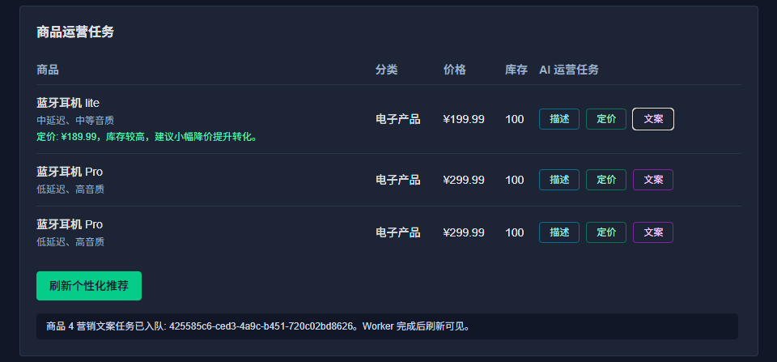
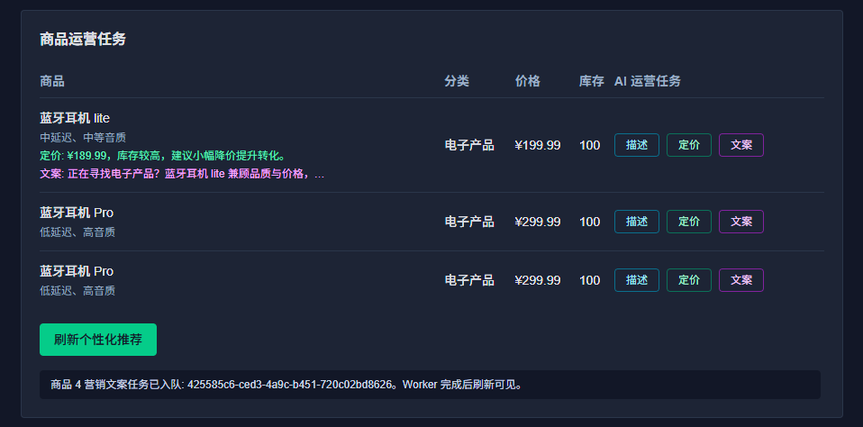
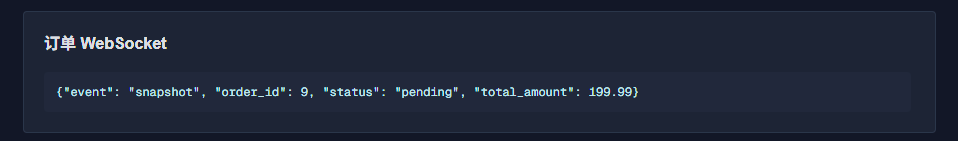

# ShopMind AI – Multi-Agent Commerce System with MCP & RAG

> **一句话概述**：面向下一代电商的智能体操作系统，对话式商务代理平台，以对话式的自然语言交互、多智能体协作、MCP 标准协议驱动商品发现和 AI 自动化决策与运营，将购物方式和体验从“搜索”进化为“对话”，也将商品搜索、推荐、对比与下单流程整合为统一体验。目标是将购物决策链路从平均8次点击缩短为1句话，是电商的 AI 时代进化路线之一。

> *This next-generation e-commerce intelligent agent operating system and conversational business agent platform uses conversational natural language interaction, multi-agent collaboration, and the MCP standard protocol to drive product discovery and AI-automated decision-making and operations. It evolves the shopping experience from "search" to "conversation," integrating product search, recommendation, comparison, and order placement into a unified experience. The goal is to shorten the shopping decision-making process from an average of eight clicks to just one sentence.*

<!-- 1. 项目健康度：许可证、测试 -->


<!-- 2. 核心技术栈：后端语言/框架，前端框架 -->


<!-- 3. AI 与核心能力：Agent、RAG、关键库 -->


<!-- 4. 基础设施与协作：数据库、缓存、消息队列、部署 -->


## 🎯 项目背景与设计思路 Why this project

传统电商平台主要依赖关键词搜索、固定筛选条件与静态推荐逻辑。面对复杂购买需求（如预算、用途、性能与偏好组合），用户往往需要在多个页面之间反复筛选、比较与跳转，决策成本较高。

随着大模型与 Agent 工作流的发展，自然语言交互逐渐成为新的用户入口。相比传统搜索，对话式购物（Conversational Commerce）允许用户直接表达需求，由系统完成商品检索、对比分析、推荐解释与购买辅助。

基于这一思考，ShopMind AI 尝试构建一个面向电商场景的多智能体对话式系统，将搜索、推荐、对比、加购与下单流程整合为统一的自然语言交互体验，并探索 Agent workflow、RAG 检索增强与工具调用在智能电商中的工程化实践。


## 🧠 核心能力 Core Competencies

- **对话式购物助手**：自然语言交互，用户说"想买500元以内的蓝牙耳机，延迟要低"，AI 自动理解意图、提取参数、搜索商品、对比推荐。
- **多智能体协作**：由 Supervisor Agent 统一调度，Intent Router Agent (意图识别)、Planning Agent (任务分解)、Product Search Agent、Comparison Agent、Recommendation Agent、Cart & Order Agent 等组成虚拟电商运营团队，通过 MCP 和 A2A 协议标准化通信。
- **AI 辅助运营**：通过 Celery 异步任务支持商品描述生成、动态定价建议、营销文案生成和个性化推荐刷新。
- **实时可观测性**：SSE 展示 Agent 推理轨迹（ReAct-style trace）/工具调用过程，WebSocket 推送订单状态，运营仪表盘展示意图、工具、延迟和事件流。
- **生产级工程化雏形**：service 层独立、Celery 异步任务、PostgreSQL + Alembic 迁移、Redis-first 会话状态、LLM 网关治理、Pytest 测试、Docker 部署。


## 🏗️ 技术架构 Technical Architecture



- **前端**：React 19 + Next.js 16 + TypeScript + Tailwind CSS + Zustand
- **后端**：FastAPI + Service/Repository 分层 + JWT
- **AI 引擎**：LangChain + LangGraph + Qwen (LLM) + DashScope (Embedding)
- **向量数据库**：**Milvus** (生产目标) / Chroma (开发备选)，已接入商品搜索的语义排序阶段并支持本地降级
- **异步任务**：Celery + Redis
- **实时通信**：FastAPI SSE（对话流）+ WebSocket（订单状态推送）
- **数据库**：PostgreSQL + Alembic 迁移
- **会话状态**：Redis-first Conversation Store，Redis 不可用时回退本地内存以保证单机演示稳定
- **部署**：Vercel（前端）+ Railway / AWS（后端）


## 📂 项目结构 Project Structure

```text
ShopMind-AI/
├── .github/
│   └── workflows/
│       ├── backend-ci.yml      # FastAPI CI
│       └── frontend-ci.yml     # Next.js CI
│
├── backend/
│   ├── app/
│   │   ├── api/v1/             # API 路由层（仅处理请求/响应）
│   │   │   ├── products.py     # 商品接口
│   │   │   ├── orders.py       # 订单接口
│   │   │   ├── auth.py         # JWT 登录鉴权
│   │   │   └── chatbot.py      # 对话式购物接口
│   │   │
│   │   ├── core/               # 核心配置与安全模块
│   │   │   ├── config.py       # 环境变量配置
│   │   │   ├── security.py     # JWT 加密与权限
│   │   │   └── llm_factory.py  # Qwen / LLM 工厂
│   │   │
│   │   ├── db/                 # 数据库连接与 Session
│   │   │
│   │   ├── models/             # SQLAlchemy ORM 模型
│   │   │
│   │   ├── schemas/            # Pydantic 请求响应校验
│   │   │
│   │   ├── services/           # 业务逻辑层（独立）
│   │   │   ├── product_service.py
│   │   │   ├── order_service.py
│   │   │   ├── user_service.py
│   │   │   │
│   │   │   └── chatbot/        # AI Agent 管理模块
│   │   │       ├── agents/     # 多 Agent 实现
│   │   │       │   ├── schema.py          # AgentMessage (A2A)
│   │   │       │   ├── intent_router.py
│   │   │       │   ├── planning.py
│   │   │       │   ├── product_search.py
│   │   │       │   ├── comparison.py
│   │   │       │   ├── recommendation.py
│   │   │       │   └── cart_order.py
│   │   │       │
│   │   │       ├── tools/      # MCP Tool Calling
│   │   │       │   ├── registry.py        # ToolRegistry (MCP)
│   │   │       │   ├── caller.py          # ToolCaller
│   │   │       │   └── ...
│   │   │       │
│   │   │       ├── prompts/    # Prompt 模板
│   │   │       └── vector_store_manager.py
│   │   │
│   │   ├── tasks/              # Celery 异步任务
│   │   │   ├── celery_app.py
│   │   │   └── ai_tasks.py     # AI 商品描述/批量推荐
│   │   │
│   │   └── mcp/                # MCP Tool Server
│   │
│   ├── alembic/                # 数据库迁移
│   ├── tests/                  # Pytest 自动化测试
│   │
│   ├── .env.example            # 环境变量模板
│   ├── Dockerfile
│   ├── requirements.txt        # 用于快速部署
│   ├── pyproject.toml          # 用于现代 Python 工程配置
│   └── main.py
│
├── frontend/
│   ├── public/
│   │
│   ├── src/
│   │   ├── app/                # Next.js App Router页面
│   │   │
│   │   ├── components/
│   │   │   ├── chat/           # 对话式购物 UI
│   │   │   └── dashboard/      # AI 运营仪表盘
│   │   │
│   │   ├── hooks/              # WebSocket / 自定义 Hooks
│   │   │
│   │   ├── services/           # 前端 API 调用层
│   │   │
│   │   └── store/              # Zustand 状态管理
│   │
│   ├── .env.local.example
│   ├── next.config.js
│   ├── tailwind.config.ts
│   ├── package.json
│   └── tsconfig.json
│
├── docs/
│   └── architecture.md         # Agent 系统设计文档
│
├── docker-compose.yml
├── .gitignore
├── .dockerignore
├── Makefile
├── LICENSE
└── README.md
```


## 🚀 快速开始 Quick Start

### 1. 环境准备 Environmental preparation
- Python 3.11+
- Node.js 18+
- PostgreSQL 15+
- Redis
- Milvus (可选，也可使用 Chroma 快速启动，见配置说明)
- Qwen API Key (DashScope)

### 2. 本地开发 Local development

**后端**
```bash
cd backend
python -m venv venv
source venv/bin/activate   # Windows: .\venv\Scripts\activate
pip install -r requirements.txt
cp .env.example .env        # 填写数据库连接、Qwen API Key、Milvus 地址
alembic upgrade head        # 执行数据库迁移
celery -A app.tasks.celery_app worker --loglevel=info  # 启动异步任务（可选）
uvicorn main:app --reload
```

**前端**
```bash
cd frontend
npm install
npm run dev
```

### 3. 向量数据库 Milvus/Chroma 配置说明

生产目标使用 Milvus；若想在本地快速开发或做轻量演示，可以在环境变量中设置：

```bash
VECTOR_STORE_TYPE=chroma
```

当前主搜索链路以 PostgreSQL 关键词/价格/分类过滤为主，并通过 `backend/app/services/chatbot/vector_store_manager.py` 接入语义排序；未连接外部 Milvus/Chroma 时会使用本地可解释的语义评分降级。


## 🧪 效果展示 Pages demonstration

| 功能 | 截图 |
|------|------|
| 对话式购物助手 |  |
| 商品 AI 搜索与对比 |  |
| Agent 可观测性仪表盘 |  |
| AI自动化运营-商品描述/定价/营销文案 |  |
| WebSocket 实时订单推送 |  |


## ✅ 当前完成度 Current completion status

| 模块 | 状态 |
|------|------|
| 登录鉴权 / JWT | 已实现 |
| 商品 CRUD API | 已实现 |
| 购物车 / 下单 API | 已实现 |
| 对话式购物助手 | 已实现核心链路 |
| 多轮澄清 / 会话状态 | 已实现 Redis-first Conversation Store、槽位追问和候选问题 |
| Agent 意图识别 / 计划执行 | 已实现带 evidence / confidence / required_slots 的路由结果 |
| 搜索 / 推荐 / 对比 / 加购 / 下单 | 已实现核心链路 |
| SSE Agent 过程流式展示 | 已实现 |
| Celery AI 运营任务 | 已实现商品描述 / 动态定价 / 营销文案 / 个性化推荐刷新 |
| Milvus / Chroma 向量检索 | 已接入搜索语义排序，支持本地降级 |
| MCP 独立 Tool Server | 已实现 HTTP MCP-style 工具发现与调用 |
| LLM 网关治理 | 已实现 timeout / retry / circuit breaker / fallback |
| Prompt 工程化 | 已实现 prompts/*.yaml 版本化模板 |
| 工具并发治理 | 已实现 request-scoped ToolRegistry，避免多用户工具实例串线 |
| WebSocket 订单状态推送 | 已实现 |
| 后台仪表盘 / Agent 可观测性 | 已实现 `/dashboard` 运营仪表盘 |
| Pytest 自动化测试 | 已补充核心 Agent / MCP / 向量排序 / 治理组件测试 |


## 🎯 项目亮点 Project Highlights

### AI 原生电商闭环

覆盖用户购物、商家运营、平台智能化，实现从"搜索电商"到"对话电商"的转变。

### 多智能体系统设计

采用 Supervisor + Worker Agent 架构，通过 MCP / A2A 协议、Tool Calling、Agent 路由机制，具备可扩展、可观测、可组合等工程特性。

### Agent Governance & Production-Oriented Practices

包含独立 Service 层、Redis-first 多轮会话状态、request-scoped ToolRegistry、LLM Gateway（超时、重试、熔断、降级）、Prompt 版本化模板、Celery 异步任务、PostgreSQL + Alembic、WebSocket 实时推送、Docker Compose、Pytest 自动化测试。

### MCP 与 A2A 协议实现

- **MCP (Model Context Protocol)**：所有 Agent 与工具之间的调用通过 MCP Tool Registry 管理，支持工具注册、发现、Schema 验证。
- **A2A (Agent-to-Agent) Protocol**：Agent 之间通过 `AgentMessage` 结构化对象通信，支持任务分发、结果回传、异常处理。
- **Tool Calling Abstraction**：通过 `ToolCaller` 抽象层隔离 LLM 与具体工具实现，支持热插拔。

### 向量检索抽象设计

| 环境 | 向量数据库 |
|------|-----------|
| Production | Milvus |
| Development | Chroma |

体现架构抽象能力、可替换设计能力和工程解耦能力。

### 对齐行业 AI Commerce 前沿

参考 Norce Commerce Agent SDK、Agorio SDK、VTEX AI Workspace 等 2026 年 AI 电商前沿作品。


## 🧩 挑战与解决方案 Challenges and Solutions

### 1. 多轮对话中的模糊需求澄清

**Challenge**

真实客服和导购场景中，用户第一次输入往往是不完整或模糊的，例如“我想买一台适合办公的电脑”或“这个功能怎么不好用”。如果系统只依赖关键词搜索或 FAQ 向量匹配，容易出现召回不准、过早推荐或答非所问的问题。

**Solution**

新增会话状态管理与澄清 Agent，引入 `conversation_id`、历史消息、槽位状态和候选问题机制。系统会在预算、用途、品类、偏好等关键信息不足时触发追问，引导用户补充必要信息后再进入搜索、推荐、对比或下单流程。会话存储采用 Redis-first 设计，Redis 不可用时回退内存，以兼顾本地演示稳定性和生产化扩展方向。

---

### 2. 有依据的 Agent 路由与工具选择

**Challenge**

复杂业务场景中，仅依靠大模型直接判断用户意图容易出现分类不稳定、缺少判断依据和工具误调用等问题。电商系统中的搜索、推荐、对比、加购、下单等任务边界不同，需要更清晰的路由依据和参数约束。

**Solution**

升级 Intent Router，使路由结果结构化输出 `intent / confidence / evidence / required_slots`，并接入工具 schema 与轻量业务知识检索。Agent 在执行前会先判断任务类型、置信度、必要参数和依据来源，降低无依据 function calling 带来的不稳定性，也为后续接入更完整的企业知识库和评测集预留空间。

---

### 3. 多用户并发下的工具上下文隔离

**Challenge**

第一版中存在全局 ToolRegistry 持有用户态工具实例的风险。多用户并发访问时，不同请求可能共享或覆盖工具实例，导致用户态、数据库 session 或工具上下文串线，属于真实上线时比较严重的并发隐患。

**Solution**

去掉全局用户态 ToolRegistry，改为 request-scoped registry / caller 设计。每次请求都会创建独立工具上下文，避免多用户并发下的状态污染，提高 Agent 工具调用链路的安全性、可维护性和可测试性。

---

### 4. LLM 调用链路的韧性治理与降级

**Challenge**

真实生产环境中，大模型 API 可能出现超时、限流、错误响应或结果不稳定。如果缺少统一治理层，Agent workflow 可能直接中断，导致 SSE 断流、前端报错或向用户暴露系统异常。

**Solution**

新增 LLM Gateway，集中处理 timeout、retry、circuit breaker 与 fallback，并将 LLM 调用状态写入 observability。Chat API 和 SSE 流式接口在异常时返回可控降级消息，而不是直接中断服务，为后续接入人工客服、规则兜底、多模型切换和线上告警预留扩展点。

---

### 5. Prompt 与模型调用的工程化管理

**Challenge**

Agent 系统通常包含大量路由、规划、搜索参数抽取和工具调用 prompt。如果 prompt 全部硬编码在业务代码中，后续优化、回归测试、模型替换或多人协作时容易产生维护成本和重构风险。

**Solution**

将路由、搜索参数抽取和规划 prompt 拆分为版本化 YAML 模板，放入 `prompts/` 目录统一管理；同时通过模型调用封装层隔离不同 LLM API，降低后续替换模型、调整 prompt 或扩展评测样例时对业务代码的影响。


## 🚀 开发时间线 Development Timeline

### 2025
开始从传统软件开发转向 AI Agent 系统与 LLM Application 方向，根据之前的项目中对 Amazon、Temu 等电商场景的探索经验，逐渐形成设计初衷，之后逐步完成方向探索与架构调研，调研多 Agent、RAG、Tool Calling 与电商场景可行性验证。

### Q4 2025
持续进行 AI 应用开发实践，围绕多智能体工作流、向量检索、Prompt 工程化与 LLM API 集成等方向迭代，逐步聚焦智能客服与电商场景，形成 ShopMind AI 的核心设计方向。

### Q1 2026
完成 ShopMind AI 第一版原型，实现多 Agent 对话式购物、商品搜索/推荐/对比、购物车与订单链路，引入 RAG 检索增强、向量数据库抽象与工具调用机制，并支持 SSE 可观测性与 Dashboard。

### Q2 2026
完成第一轮 Agent Governance & Routing Hardening，包括：
- Redis-first Conversation Store
- request-scoped ToolRegistry
- LLM Gateway（timeout / retry / fallback）
- Prompt YAML versioning
- Intent routing（confidence / evidence / required_slots）
- SSE graceful degradation


## 🔭 已知权衡与未来规划 Known trade-offs and future planning

本仓库定位为求职展示版和工程架构样板，已经实现智能购物 Agent 的核心链路与治理雏形；如果进入真实企业客服场景，还需要继续补齐以下生产化能力。

| 模块 | 当前实现 | 后续规划 |
| ---- | -------- | -------- |
| 压测与容量规划 | 已使用 async FastAPI、DB pool、Celery、Redis 基础设施 | 用 Locust/k6 做并发压测，定义 QPS、P95/P99、SSE 长连接容量和扩容策略 |
| 分布式会话存储 | Redis-first Conversation Store，单机 Redis 不可用时回退内存 | Redis Cluster/PostgreSQL 会话快照、跨实例恢复、会话 TTL 和隐私清理策略 |
| 真实知识库 ingestion | 轻量业务知识检索器 + 向量层抽象 | 文档/FAQ/工单 ingestion pipeline、embedding 批处理、schema version、灰度重建索引 |
| 路由与 RAG | 路由输出 intent / confidence / evidence / required_slots | 多路召回、rerank、低置信度人工复核、路由评测集和线上误判采样 |
| 权限审计 | JWT 登录鉴权、基础用户隔离 | RBAC、后台操作审计日志、敏感工具权限、订单/用户数据访问审计 |
| 灰度发布 | 环境变量配置模型、向量库和服务 URL | Prompt/模型/工具版本灰度、A/B 实验、回滚开关、release checklist |
| 监控告警 | 内存级 AgentObservability 仪表盘 | OpenTelemetry、Prometheus/Grafana、集中日志、错误率和熔断告警 |
| 人工坐席接入 | LLM/tool 异常时返回人工转接降级文案 | 对接工单/IM/CRM，传递 conversation_id、历史消息、槽位和失败原因 |
| SLA 验证 | Pytest 和本地演示验证 | 线上 SLO/SLA、故障演练、备份恢复、依赖服务降级演练 |
| 前端体验 | Web Chat、Dashboard、WebSocket 订单状态 | 移动端优化、国际化、无障碍、客服坐席后台 |


## 📦 部署架构 Deployment Architecture

| 组件 | 平台 |
|------|------|
| Frontend | Vercel |
| Backend | Railway / AWS ECS |
| Database | PostgreSQL |
| Vector Store | Milvus |

### Frontend：Vercel

- Vercel 项目 Root Directory 设置为 `frontend`
- 构建命令：`npm run build`
- 输出目录：`.next`
- 环境变量：`NEXT_PUBLIC_API_BASE_URL=https://<your-backend-domain>/api/v1`

### Backend：Railway / AWS ECS

- Railway 项目 Root Directory 设置为 `backend`
- Dockerfile 会读取平台注入的 `PORT`
- 必需环境变量：
  - `SECRET_KEY`
  - `OPENAI_API_KEY`
  - `DASHSCOPE_API_KEY`
  - `BACKEND_CORS_ORIGINS=["https://<your-frontend-domain>"]`
- Railway PostgreSQL 可直接提供 `DATABASE_URL`
- Railway Redis 可直接提供 `REDIS_URL`

### Database：PostgreSQL

后端会优先读取 `DATABASE_URL`；没有该变量时，回退到 `POSTGRES_USER`、`POSTGRES_PASSWORD`、`POSTGRES_HOST`、`POSTGRES_PORT`、`POSTGRES_DATABASE`。

### Vector Store：Milvus

生产建议使用 Zilliz Cloud / Milvus Cloud，并配置：

- `VECTOR_STORE_TYPE=milvus`
- `MILVUS_URI`
- `MILVUS_TOKEN`

轻量演示可临时使用：

- `VECTOR_STORE_TYPE=chroma`


## 👤 作者 Author

**王磊（Leon Wang）**<br>
"AI Agent & LLM Application Engineer focused on Agentic and multi-agent Systems, RAG, modern AI Infrastructure, Machine Learning, AI-native products with LLMs and Fullstack AI Products."<br>
<br>
求职 - AI Agent 应用开发 | LLM 大模型应用开发 | 全栈工程师 | AI 全栈产品开发<br>
AI Agent Engineer | LLM Application Engineer | Fullstack Developer | Fullstack AI Products<br>
<br>
📍 Based in Nanjing / Shanghai / Hangzhou / Suzhou, China<br>
📍 Open to opportunities across Sydney / Melbourne / Brisbane / Adelaide, Australia & Auckland, New Zealand (Work visa holder)<br>
<br>

Email: leileonwang@163.com / leonleiwang@outlook.com<br>
GitHub: https://github.com/leonleiwang


## 📄 许可证 License
MIT License
