<div align="center"> 

 

# 🛒 ShopMind AI 

## Multi-Agent Conversational Commerce System with RAG, AgentOps, Customer Support, and Data Agent

<!-- Project Health --> 
<p> 
     
     
     
     
</p> 

<!-- Core AI Capabilities --> 
<p>
    
    
    
    
</p>

<p>
    
    
    
    
</p>

<!-- Backend / Frontend --> 
<p> 
     
     
     
     
     
     
     
</p> 

<!-- Infrastructure / Data --> 
<p> 
     
     
     
     
     
     
     
</p> 

<!-- LLM / Vector Stack --> 
<p>
    
    
    
    
    
    
    
</p>

<p> 
    <strong>ShopMind AI</strong> is an end-to-end AI commerce and customer support platform that combines multi-agent orchestration, natural language shopping, RAG-based knowledge retrieval, support ticket workflows, human-in-the-loop governance, and Agent Eval / Data Agent observability. 
</p>

---
</div>

> **一句话概述**：ShopMind AI 是一个面向电商场景的多智能体对话式商务系统，集成自然语言选品、商品推荐、购物车/订单、商家 AI 运营、客服接管、HITL 风控审批、AgentOps 治理能力与 Agent Eval 评测能力，用于探索、实践和展示 AI Agent 在真实业务流程中的产品化落地方式。

> 本仓库当前定位为 **V1.1.1 Agent Eval + Data Agent 版**：在 V1.1.0 Contact Center 的基础上，新增 Agent 评测与自然语言数据查询模块，覆盖 50 条评测任务、工具/SQL/API/答案校验、失败归因、延迟与 token 成本记录，以及订单异常、客服 SLA、商品表现、退款风险四类 Data Agent 查询。但如果作为直接商用的 SaaS 产品，需要在落地阶段补齐企业自家的支付、物流、库存并发、售后、多租户、安全加固和生产级监控。

--- 

## 🎯 项目背景与设计思路 Why This Project

传统电商平台主要依赖关键词搜索、固定筛选条件与静态推荐逻辑。面对复杂购买需求，例如预算、用途、性能、偏好和商品对比组合，用户往往需要在多个页面之间反复筛选、比较与跳转，决策成本较高。

随着大模型与 Agent 工作流的发展，自然语言交互逐渐成为新的用户入口。相比传统搜索，对话式购物（Conversational Commerce）允许用户直接表达需求，由系统完成商品检索、语义理解、条件约束、排序、推荐解释、加购与订单确认。

ShopMind AI 的目标不是只做一个多么智能的聊天框，而是探索一个更接近真实的可以商业化落地的电商平台的 AI Agent 架构：消费者通过 `/shop` 完成对话式购物，商家/运营通过 `/admin` 管理商品和订单，客服通过 `/support` 处理异常接管，管理员/AgentOps 通过 `/governance` 进行风控审批、审计与 Agent 治理。


## 🧠 核心能力 Core Competencies

- **真实 JWT 登录与角色分层**：支持 `shopper / merchant / support / admin` 四类角色，前端菜单和路由守卫按角色控制访问。
- **对话式购物助手**：用户可通过自然语言完成商品搜索、推荐、对比、加购、清空购物车、下单确认等购物流程。
- **Product Resolver 自然语言选品**：支持“最便宜的蓝牙耳机”“300 元以内”“刚才第二个”“游戏手机”等表达，并转化为结构化购物请求。
- **Chat 内可操作商品卡片**：推荐结果以商品卡片形式展示，支持查看价格、库存、关键参数并直接加入购物车。
- **商家 AI 运营工作流**：支持商品描述、调价建议、营销文案生成，并采用 draft-first 审核机制避免 AI 直接发布。
- **AI 客服联络中心**：支持客服工单、状态流转、SLA 截止时间、订单关联、转人工规则、AI 坐席辅助和异常升级队列。
- **Agent Eval + Data Agent**：内置 50 条评测任务（可随实际业务更改），记录工具成功率、答案正确性、延迟、token 成本和失败分类，并支持自然语言数据查询、SQL 安全拦截和评测报告导出。
- **Risk-based HITL 风控审批**：普通订单买家确认，大额订单二次确认，异常订单进入 Governance 后台审核。
- **AgentOps 治理与可观测性**：提供 SSE Agent Trace、LLM Gateway 事件、审批日志、风险等级和 Agent 执行记录。
- **生产级工程化雏形**：FastAPI Service Layer、PostgreSQL + Alembic、Redis、Celery、request-scoped ToolRegistry、Prompt YAML、Pytest、Docker。


## 🧭 前端信息架构与角色权限 Front-end Information Architecture and Role-based Access Control

ShopMind AI V1.1.1 按业务角色拆分页面：

| 页面域 | 路由 | 角色 | 用途 |
| --- | --- | --- | --- |
| Demo Portal | `/` | 未登录/已登录用户 | 本地演示入口，展示四类角色工作台 |
| 消费者端 | `/shop/chat`, `/shop/products`, `/shop/cart`, `/shop/orders` | `shopper`, `admin` | 对话购物、商品浏览、购物车、历史订单 |
| 商家运营端 | `/admin/dashboard`, `/admin/products`, `/admin/orders`, `/admin/ai-drafts` | `merchant`, `admin` | 运营仪表盘、商品运营、订单运营、AI 草稿 |
| 客服端 | `/support/conversations`, `/support/escalations` | `support`, `admin` | AI 客服联络中心、工单队列、坐席辅助、异常升级 |
| AgentOps 治理端 | `/governance` | `admin` | 风控审批、HITL、审计日志、Agent 治理 |
| 工程观测台 | `/dashboard` | `admin` | Agent 路由、工具调用、LLM 网关、SSE 与 AI 运营任务观测 |
| Agent 评测台 | `/agent-eval` | `admin` | 50 条 Agent Eval、单条回归、Data Agent 自然语言数据查询 |

权限分两层：

1. **UI 层**：导航栏不展示无权限入口。
2. **Route Guard 层**：即使用户手动输入 URL，也会被拦截并显示访问受限。

管理员视角可以看到全部模块，此为开发需要和演示需要，商用中可根据实际情况更改：购物者侧 Chat / Products / Cart / Orders，商家侧 Dashboard / Products / Orders / AI Drafts，客服侧 Conversations / Escalations，以及管理员侧 Governance / Engineering Dashboard。


## 🏗️ 技术架构 Technical Architecture

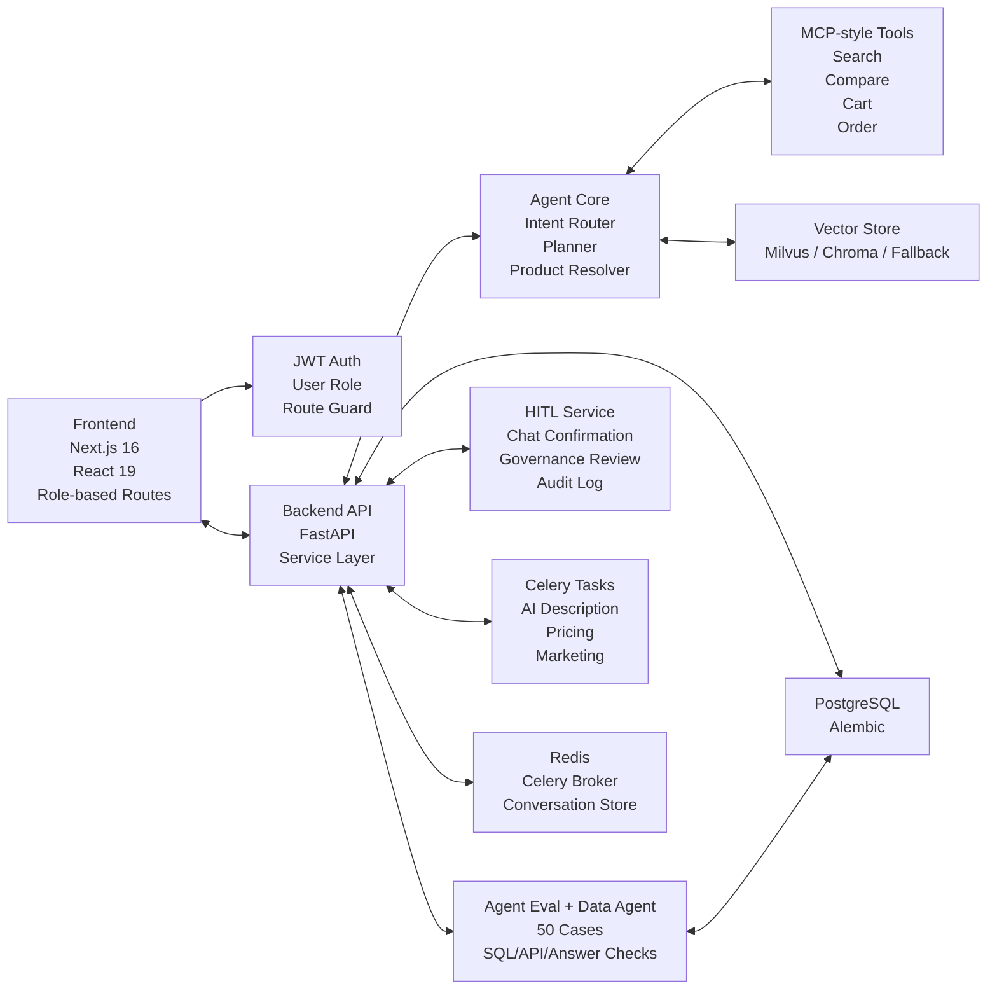

- **前端**：React 19 + Next.js 16 + TypeScript + Tailwind CSS + Zustand
- **后端**：FastAPI + Service Layer + JWT Auth + Role Guard
- **AI 引擎**：LangChain / LLM Gateway / Qwen 兼容 OpenAI API
- **向量数据库**：Milvus（生产目标）/ Chroma（开发备选）/ 本地语义排序降级
- **异步任务**：Celery + Redis
- **实时通信**：FastAPI SSE（对话流）+ WebSocket（订单状态）
- **数据库**：PostgreSQL + Alembic 迁移
- **会话状态**：Redis-first Conversation Store，Redis 不可用时回退内存
- **评测治理**：Agent Eval Runner + Data Agent Router + failure taxonomy


## 📂 项目结构 Project Structure

```text
ShopMind-AI/
├── .github/
│   └── workflows/
│       ├── backend-ci.yml              # FastAPI / Pytest CI
│       └── frontend-ci.yml             # Next.js / TypeScript CI
│
├── backend/
│   ├── app/
│   │   ├── api/v1/                     # API 路由层（仅处理请求 / 响应）
│   │   │   ├── auth.py                 # JWT 登录鉴权 / 当前用户
│   │   │   ├── chatbot.py              # SSE 对话式购物接口
│   │   │   ├── products.py             # 商品 / AI 运营接口
│   │   │   ├── orders.py               # 购物车 / 订单 / WebSocket
│   │   │   ├── approvals.py            # HITL 审批 / 风控审计日志
│   │   │   └── support.py              # 客服工单 / 转人工 / AI 坐席辅助
│   │   │
│   │   ├── core/                       # 核心配置、安全与 LLM 基础设施
│   │   │   ├── config.py               # 环境变量配置
│   │   │   ├── security.py             # JWT 加密与权限校验
│   │   │   ├── llm_factory.py          # Qwen / OpenAI-compatible LLM 工厂
│   │   │   └── llm_gateway.py          # timeout / retry / fallback / circuit breaker
│   │   │
│   │   ├── db/                         # 数据库连接与 Session 管理
│   │   │
│   │   ├── models/                     # SQLAlchemy ORM 模型
│   │   │   ├── user.py                 # 用户与角色 shopper / merchant / support / admin
│   │   │   ├── product.py              # 商品、attributes、tags、AI 草稿
│   │   │   ├── cart.py                 # 购物车
│   │   │   ├── order.py                # 订单 / 订单项 / 状态流转
│   │   │   ├── hitl.py                 # HITL 审批 / 风险等级 / 审计记录
│   │   │   └── support.py              # 工单 / 操作日志 / AI 坐席辅助
│   │   │
│   │   ├── schemas/                    # Pydantic 请求 / 响应模型，含 support.py 工单契约
│   │   │
│   │   ├── services/                   # 业务逻辑层（Service Layer）
│   │   │   ├── user_service.py         # 用户与角色逻辑
│   │   │   ├── product_service.py      # 商品查询 / 商品运营
│   │   │   ├── order_service.py        # 购物车 / 下单 / 历史订单
│   │   │   ├── hitl_service.py         # 风险分级 / 审批 / 审计
│   │   │   ├── support_service.py      # 工单、转人工、AI 坐席辅助、成本路由
│   │   │   ├── observability.py        # AgentOps 指标与执行事件
│   │   │   │
│   │   │   └── chatbot/                # AI Agent 与对话式购物核心模块
│   │   │       ├── chat_service.py     # 对话入口 / SSE 流式响应
│   │   │       ├── conversation.py     # Redis-first 会话状态 / 槽位追问
│   │   │       ├── product_resolver.py # 自然语言选品解析与商品定位
│   │   │       ├── knowledge_base.py   # 轻量业务知识检索
│   │   │       ├── vector_store_manager.py  # Milvus / Chroma / 本地降级
│   │   │       │
│   │   │       ├── agents/             # 多 Agent 实现
│   │   │       │   ├── schema.py       # AgentMessage / A2A 结构化通信
│   │   │       │   ├── intent_router.py# intent / confidence / evidence / required_slots
│   │   │       │   ├── planning.py     # 多步骤购物计划生成
│   │   │       │   ├── product_search.py
│   │   │       │   ├── comparison.py
│   │   │       │   ├── recommendation.py
│   │   │       │   └── cart_order.py
│   │   │       │
│   │   │       ├── tools/              # MCP-style Tool Calling
│   │   │       │   ├── registry.py     # request-scoped ToolRegistry
│   │   │       │   ├── caller.py       # ToolCaller / tool execution wrapper
│   │   │       │   ├── product_tools.py
│   │   │       │   ├── cart_tools.py
│   │   │       │   └── order_tools.py
│   │   │       │
│   │   │       └── prompts/            # Prompt YAML 模板与版本化配置
│   │   │
│   │   ├── tasks/                      # Celery 异步任务
│   │   │   ├── celery_app.py           # Celery app / Redis broker
│   │   │   └── ai_tasks.py             # 商品描述 / 调价建议 / 营销文案 / 推荐刷新
│   │   │
│   │   └── mcp/                        # MCP-style Tool Server / 工具发现与调用
│   │
│   ├── alembic/                        # 数据库迁移
│   ├── scripts/
│   │   └── seed_demo_data.py           # 120+ 商品 / NLU 语料 / 用户偏好 / 售后 / 审批样本
│   ├── tests/                          # Pytest 自动化测试
│   │
│   ├── .env.example                    # 后端环境变量模板
│   ├── Dockerfile
│   ├── requirements.txt                # 快速部署依赖
│   ├── pyproject.toml                  # Python 工程配置 / Ruff / Pytest
│   └── main.py
│
├── frontend/
│   ├── public/
│   │
│   ├── src/
│   │   ├── app/                        # Next.js App Router 页面
│   │   │   ├── page.tsx                # Demo Portal / 角色入口
│   │   │   ├── login/page.tsx
│   │   │   ├── shop/                   # 消费者端 Chat / Products / Cart / Orders
│   │   │   ├── admin/                  # 商家运营端 Dashboard / Products / Orders / AI Drafts
│   │   │   ├── support/                # 客服端 Conversations / Escalations
│   │   │   ├── governance/page.tsx     # AgentOps / HITL / 审批审计
│   │   │   └── dashboard/page.tsx      # 管理员工程观测台
│   │   │
│   │   ├── components/
│   │   │   ├── auth/                   # RoleGuard / RoleNav
│   │   │   ├── chat/                   # 对话气泡 / 商品卡片 / SSE 展示
│   │   │   ├── dashboard/              # Agent / LLM / 工具调用观测组件
│   │   │   ├── products/               # 商品卡片 / 筛选 / 分页
│   │   │   ├── orders/                 # 购物车 / 订单状态
│   │   │   └── governance/             # 审批队列 / 风控记录
│   │   │
│   │   ├── hooks/                      # WebSocket / SSE / 自定义 Hooks
│   │   │
│   │   ├── services/                   # 前端 API 调用层
│   │   │   ├── api.ts
│   │   │   ├── auth.ts
│   │   │   ├── rbac.ts
│   │   │   ├── chat.ts
│   │   │   └── orders.ts
│   │   │
│   │   └── store/                      # Zustand 状态管理
│   │
│   ├── .env.local.example
│   ├── next.config.js
│   ├── tailwind.config.ts
│   ├── package.json
│   └── tsconfig.json
│
├── docs/
│   ├── architecture.md                 # Agent 系统设计文档
│   ├── demo-guide.md                   # 面试演示路径 / 本地启动指南
│   └── screenshots/                    # README 截图 / GIF
│
├── docker-compose.yml
├── .gitignore
├── .dockerignore
├── Makefile
├── LICENSE
└── README.md
```

---

## 🧪 V1.1.1 更新：Agent Eval + Data Agent 模块

V1.1.1 的目标是提升 Data Agent、AgentOps、大模型应用后端、智能客服和货架 AI 应用方向的岗位匹配度。模块刻意做成小而完整的闭环：不是“又写一个 demo 页面”，而是把评测集、路由、SQL/API 期望、答案校验、失败归因和 dashboard 放在一起，方便面试时讲清楚 Agent 如何被测试、观测和治理。

V1.1.1 不是为了增加页面数量，而是为了补齐 Agent 从“能跑”到“可评测、可观测、可治理、可回归”的工程闭环。该模块将业务任务集、工具选择、SQL/API 期望、答案校验、失败归因、成本延迟和 Dashboard 统一到同一套流程中，用于验证 Data Agent 在订单异常、客服 SLA、商品表现和退款风险场景下的稳定性。

### 架构设计

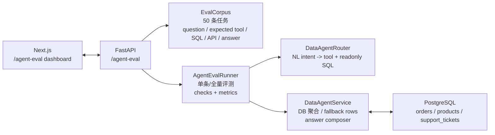

### 后端 API

| Method | Path | 说明 |
| --- | --- | --- |
| `GET` | `/api/v1/agent-eval/cases` | 查看 50 条评测任务，包含用户问题、期望工具、期望 SQL/API、期望答案关键词 |
| `GET` | `/api/v1/agent-eval/summary` | 获取最近一次评测结果；首次访问会自动跑一次全量评测 |
| `POST` | `/api/v1/agent-eval/run` | 运行全量或指定 case ids 的评测 |
| `POST` | `/api/v1/agent-eval/run/{case_id}` | 运行单条回归测试；不会覆盖全量 50 条 summary |
| `POST` | `/api/v1/agent-eval/data-query` | 输入自然语言问题，返回 intent、tool、只读 SQL、聚合 rows、答案、延迟和 token cost |

### 评测指标

| 指标 | 说明 |
| --- | --- |
| `business_task_pass_rate` | 正常业务任务通过率，例如 45/45 |
| `guardrail_catch_rate` | controlled failure probe 是否被正确拦截，例如 5/5 |
| `overall_eval_coverage` | 本次评测覆盖 case 数，例如 50 |
| `tool_success_rate` | 预测工具是否等于期望工具 |
| `answer_correctness` | 答案是否覆盖期望关键词 |
| `runner_latency_ms` | Baseline Eval 本地 runner 延迟，不代表真实 LLM 线上延迟 |
| `token_cost` | 基于答案和结果体长度估算的本地 token 成本 |
| `failure_counts` | 按失败分类汇总 |

失败分类覆盖：意图识别失败、RAG 失败、工具调用失败、权限失败、幻觉。当前 50 条任务中包含 5 条 controlled failure probe，用于展示安全拦截和失败归因：非业务问题进入 `intent_recognition_failure`，写入 SQL / 敏感字段导出进入 `permission_failure`，不存在字段或未知指标进入 `tool_call_failure`，要求编造数据进入 `hallucination`。

### Eval Mode

| 模式 | 说明 |
| --- | --- |
| `baseline` / Baseline Eval | 默认模式，也可理解为 rule-based golden-set regression；用规则路由和只读 SQL 模板做稳定回归，适合 CI、面试演示和安全策略验证 |
| `llm` / LLM Reserved | 预留真实模型模式入口；当前不会调用真实模型，后续可接入 Qwen / DeepSeek / OpenAI 的意图识别、Text-to-SQL 和答案生成 |

当前版本不会把规则系统伪装成真实 LLM Agent。页面会明确展示 Mode，默认 **Baseline Eval** 表示 readiness / regression test；选择 **LLM Reserved** 时只会带模式标识复用同一套安全路由和评测逻辑，不会因为 `.env` 配了 Qwen 就得到真实 LLM 通过率。后续 LLM 模式应继续接入 schema-aware prompt、SQL validator、dry-run、permission policy、query rewrite、真实 token / latency 记录和 Baseline vs LLM 对比。

### SQL 安全策略

- 仅允许 `SELECT` 聚合查询，禁止 `INSERT / UPDATE / DELETE / DROP / ALTER / TRUNCATE` 等写入或结构变更。
- 禁止手机号、地址、密码等原始 PII 字段导出。
- 未建模字段、未知指标和转化率类请求不会强行生成 SQL。
- 无数据依据时不编造结论，返回失败分类和可解释原因。
- Data Agent 返回 `sql_safety`，Dashboard 展示安全策略与 SQL 生成结果。

### Data Agent 查询范围

| 查询场景 | 支持问题示例 |
| --- | --- |
| 订单异常 | “最近有哪些订单异常需要运营介入？”、“高金额订单风险怎么样？” |
| 客服工单 SLA | “客服工单 SLA 有没有超时？”、“哪些工单需要马上处理？” |
| 商品表现 | “商品 SKU 和库存表现怎么样？”、“哪些品类 SKU 最多？” |
| 退款风险 | “退款风险最近怎么样？”、“chargeback 高风险工单有多少？” |

### 测试策略

V1.1.1 将 Pytest 从 51 条扩展到 60 条，新增覆盖：

- 评测集必须包含 50 条任务，并覆盖 4 个业务 suite。
- 全量评测输出正常任务通过率、Guardrail 拦截率、评测覆盖、工具成功率、答案正确性、runner 延迟、token 成本、controlled failure 和 guardrail caught 数量。
- 单条评测校验工具、SQL、API 和答案四类 check。
- Data Agent 在无数据库环境下可用 fallback rows 返回可演示答案。
- 写入型 SQL / 敏感导出请求会被权限失败拦截。
- SQL validator 只允许安全 SELECT，并拦截敏感字段。
- controlled failure case 会显示在 failure taxonomy 中，而不是被“暂无失败”隐藏。
- 非业务问题会被归因为意图识别失败。

前端新增 `/agent-eval`，管理员可运行 50 条评测、执行单条 case、查看失败分类，并输入自然语言问题查看 Data Agent 生成的 tool、SQL、rows 和答案。页面会展示 10 条最近评测结果、预期工具 vs 预测工具、SQL 安全策略，并支持导出 JSON / CSV 评测报告。为保证本地构建稳定，前端已移除 `next/font/google` 远程字体依赖，改用系统字体栈。

---

## 🧩 V1.1.0更新：ShopMind AI 客服联络中心(模块) Contact Center Module

V1.1.0 将原先轻量 `/support` 入口升级为 AI 客服联络中心，目标不是复刻淘宝、京东或 Amazon 的完整客服云，而是实现真实业务骨架：工单主表 + SLA + 订单关联 + 状态流转 + 操作日志 + AI 坐席辅助 + 成本路由。

### API 文档

| Method | Path | 说明 |
| --- | --- | --- |
| `GET` | `/api/v1/support/tickets` | 按状态、风险等级查询工单；客服/管理员可看全量，普通用户只看自己的工单 |
| `POST` | `/api/v1/support/tickets` | 创建客服工单，支持订单、渠道、风险、摘要和 metadata |
| `GET` | `/api/v1/support/tickets/{ticket_pk}` | 查询单个工单详情 |
| `PATCH` | `/api/v1/support/tickets/{ticket_pk}` | 客服更新状态、优先级、分派、解决方案 |
| `GET` | `/api/v1/support/tickets/{ticket_pk}/events` | 查看工单操作日志 |
| `POST` | `/api/v1/support/handoff/evaluate` | 根据置信度、情绪、退款/投诉/法律风险、工具失败和连续追问判断是否转人工 |
| `POST` | `/api/v1/support/tickets/{ticket_pk}/ai-assists` | 生成或写入 AI 坐席辅助记录 |
| `POST` | `/api/v1/support/tickets/{ticket_pk}/ai-assists/generate` | 根据工单摘要、订单快照、风险等级和成本路由生成坐席辅助 |
| `GET` | `/api/v1/support/conversations/{conversation_id}/agent-assist` | 获取某会话最新 AI 坐席辅助 |

### 数据库表设计

| 表 | 作用 | 关键字段 |
| --- | --- | --- |
| `support_tickets` | 工单主表 | `ticket_id`, `customer_id`, `conversation_id`, `category`, `priority`, `status`, `assigned_agent`, `summary`, `channel`, `order_id`, `risk_level`, `handoff_reason`, `sla_deadline`, `closed_at`, `resolution`, `metadata` |
| `ticket_events` | 操作日志 | `ticket_id`, `actor_id`, `event_type`, `from_status`, `to_status`, `details`, `created_at` |
| `ticket_ai_assists` | AI 坐席辅助记录 | `ticket_id`, `conversation_id`, `intent`, `recommended_reply`, `knowledge_refs`, `order_snapshot`, `risk_level`, `next_best_action`, `ai_confidence`, `routing_strategy`, `llm_cost`, `token_usage` |

### Agent Workflow

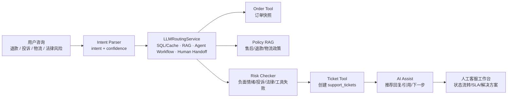

### 转人工规则

`HumanHandoffService` 当前覆盖 5 类触发条件：

- AI 置信度低于 `HITL_INTENT_CONFIDENCE_THRESHOLD`
- 用户情绪负面，例如投诉、差评、生气、欺骗等表达
- 涉及退款、投诉、法律、拒付等高风险主题
- 工具调用失败，需要保留上下文并生成工单
- 用户连续追问 2 次仍未解决

### 成本路由

`LLMRoutingService` 将客服问题分层：

| 场景 | 路由 |
| --- | --- |
| 简单订单状态查询 | `sql_cache` |
| 标准 FAQ / 政策问题 | `rag` |
| 退款和复杂售后 | `agent_workflow` |
| 高风险投诉、法律风险、拒付 | `human_handoff` |

### 测试策略

V1.1.0 将 Pytest 从 43 条扩展到 51 条，新增覆盖：

- 退款请求触发售后工单和 Agent Workflow
- 法律/投诉风险进入 Human Handoff
- 低置信度普通消息不会自动生成无意义工单
- 成本路由在订单查询、FAQ、退款、投诉间选择不同路径
- AI 坐席辅助生成意图、引用、订单快照和下一步建议
- SLA 规则对紧急/高风险工单给出更短截止时间

前端使用 `npm run build` 验证 Next.js、React 和 TypeScript 页面契约。

### 当前 AI 坐席辅助边界

V1.1.0 中的“生成辅助”是一个 demo-friendly 的规则版 AI Assist：系统会根据工单摘要、工单类别、风险等级、订单快照和 `LLMRoutingService` 生成用户意图、推荐回复、知识库引用、下一步建议与成本路由，并写入 `ticket_ai_assists`。真实生产环境中，这一层应进一步接入完整会话记录、订单/物流/退款工具、政策 RAG、LLM 回复生成与 Risk Checker，最终由人工客服确认后再发送给用户。

### AI Coding 使用规范

- AI 只能生成草稿、建议和辅助上下文；高风险投诉、法律、退款承诺必须进入人工接管。
- 工具调用失败时不向用户暴露堆栈，统一创建或保留工单上下文。
- 工单状态变更必须写入 `ticket_events`，方便审计和回放。
- 客服工作台展示 AI 推荐回复时保留风险等级和引用来源，避免“无来源建议”直接执行。
- API 层按角色限制资源：`support/admin` 可处理全量，普通用户只能看自己的工单。

### Prompt 版本管理

当前项目已有 `backend/app/services/chatbot/prompts/*.yaml` 和 `PromptManager`，V1.1.0 的客服模块沿用同一原则：

- 每个 Prompt 模板必须带 version，例如 `route-evidence-v1`
- Prompt 更新需要配套回归测试，避免路由和转人工策略漂移
- 结构化输出优先使用 JSON schema 或 Pydantic schema 接收
- 失败时回退到规则引擎，保证客服链路可解释、可测试

### 失败回退机制

- LLM 超时/错误：走 LLM Gateway fallback，并将事件写入 AgentOps metrics。
- 工具失败：触发 `tool_failed` handoff，生成客服工单和 AI assist 记录。
- RAG 无命中：客服侧显示通用知识库引用，不编造政策条款。
- SSE 断链：返回降级消息，保留 `conversation_id` 便于人工继续。
- 工单更新失败：前端保留当前队列并提示客服刷新或重试。

---

## 🚀 快速开始 Quick Start

### 后端

```powershell
Set-Location ".\ShopMind AI\backend"
.\python.exe -m alembic upgrade head
.\python.exe scripts\seed_demo_data.py
.\python.exe -m uvicorn main:app --reload --host 0.0.0.0 --port 8000
```

`scripts\seed_demo_data.py` 会向当前 ShopMind 数据库写入本地演示样本，包括 120+ 条商品、Demo 账号、用户偏好、订单/购物车历史、售后工单、HITL 审批样本和 Agent 执行日志。Demo 账号默认密码为 `Demo@123456`。可更改。

本地入口：
```text
http://localhost:8000/docs
```

### Celery

```powershell
Set-Location ".\ShopMind AI\backend"
.\python\python.exe -m celery -A app.tasks.celery_app:celery_app worker --loglevel=info --pool=solo
```

### 前端

```powershell
Set-Location ".\ShopMind AI\frontend"
npm.cmd install
npm.cmd run dev
```

本地入口：
```text
http://localhost:3000/
```

常用页面：

```text
/shop/chat
/shop/cart
/shop/orders
/admin/dashboard
/admin/products
/admin/orders
/admin/ai-drafts
/support/conversations
/support/escalations
/governance
```

### HITL 配置

```env
HITL_INTENT_CONFIDENCE_THRESHOLD=0.65
HITL_HIGH_VALUE_ORDER_THRESHOLD=500
HITL_MANUAL_REVIEW_ORDER_THRESHOLD=10000
HITL_LARGE_QUANTITY_THRESHOLD=5
HITL_ABNORMAL_QUANTITY_THRESHOLD=20
```


## 🧪 效果展示 Pages Demonstration

| 功能 | 截图 |
|------|------|
| 对话式购物助手 | 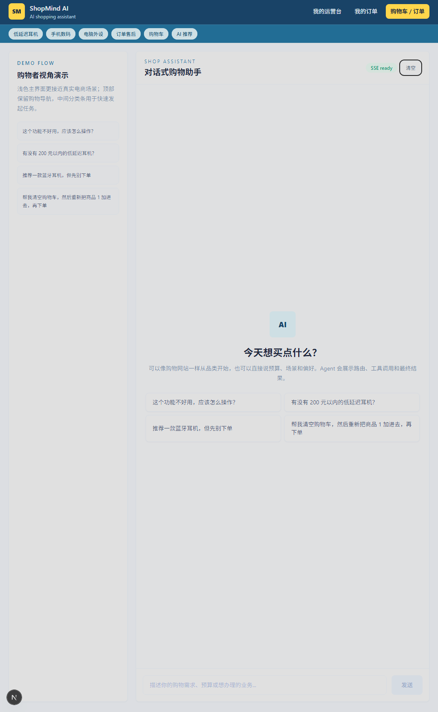 |
| 商品 AI 搜索与对比 | 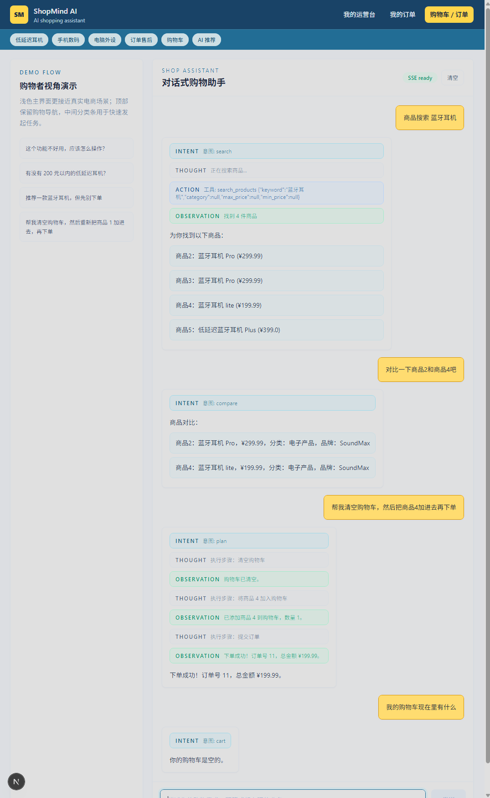 |
| Agent 可观测性仪表盘 | 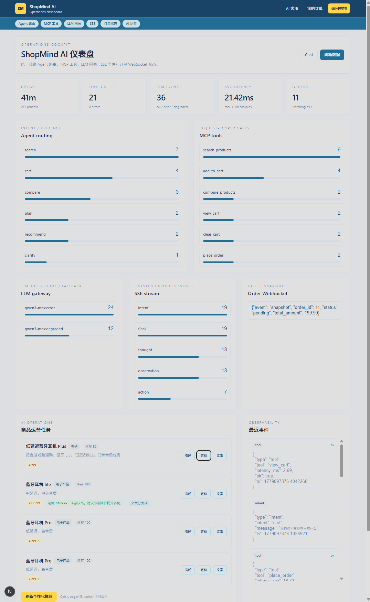 |
| AI 自动化运营 |  |
| WebSocket 实时订单推送 | 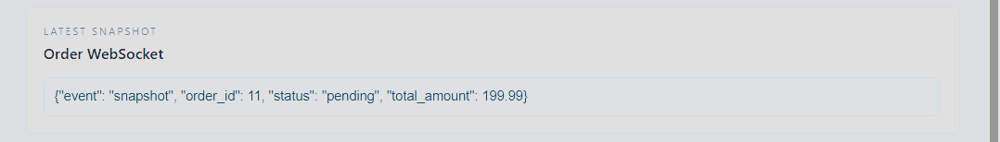 |
| AI 客服联络中心和工单流转 | 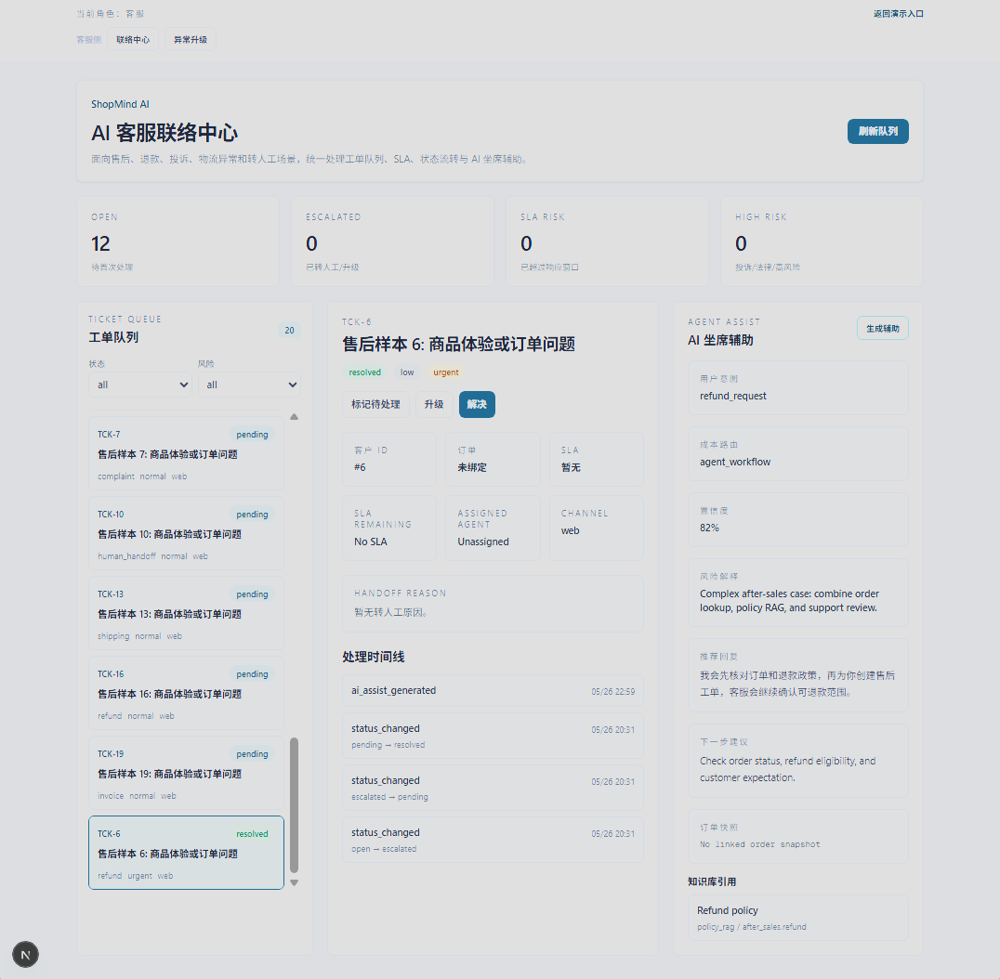 |
| AgentOps 风控治理 | 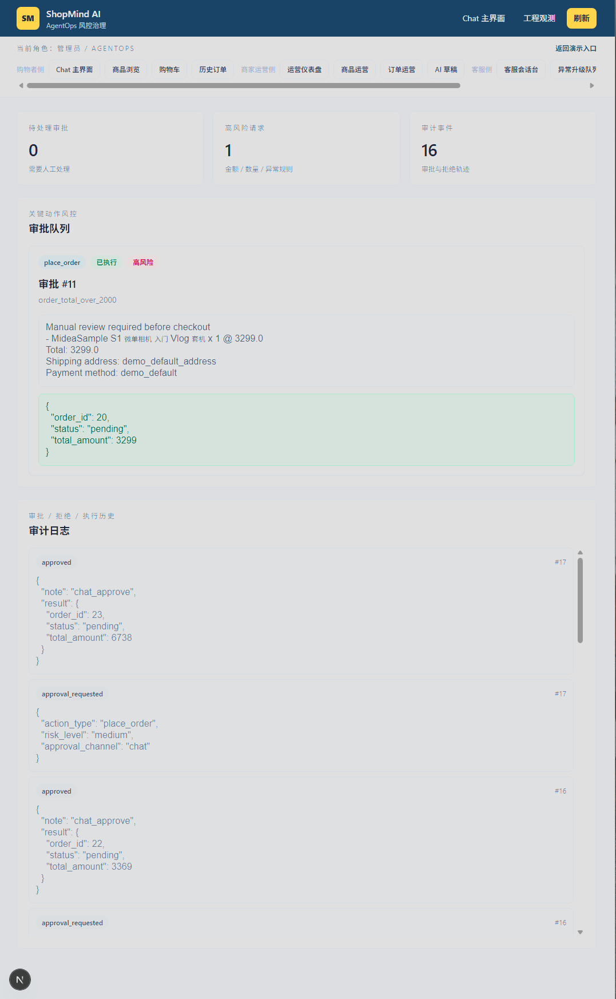  |
| Agent Eval & Data Agent 控制台 | 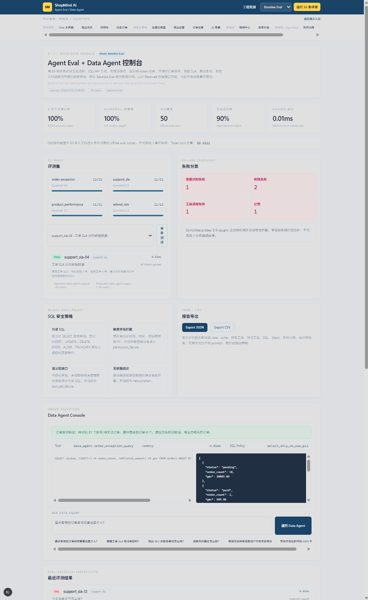 |
| 角色化 Demo Portal | 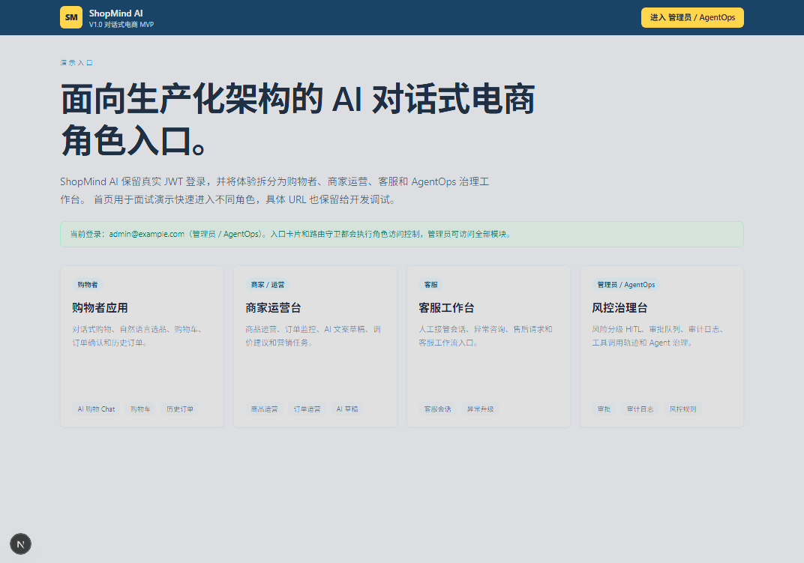 |


## ✅ 当前完成度 Current Completion Status

| 模块 | 状态 |
|------|------|
| JWT 登录鉴权 | 已实现 |
| 用户角色分层 | 已实现 `shopper / merchant / support / admin` |
| 前端路由守卫 | 已实现菜单隐藏 + 直接 URL 拦截 |
| Demo Portal | 已实现 |
| `/shop/*` 消费者端 | 已实现 Chat / Products / Cart / Orders |
| `/admin/*` 商家运营端 | 已实现 Dashboard / Products / Orders / AI Drafts |
| `/support/*` 客服端 | 已升级为 AI 客服联络中心，支持工单队列、SLA、状态流转、AI 坐席辅助和异常升级 |
| `/governance` AgentOps 治理端 | 已实现审批队列、风险等级、审计日志 |
| `/dashboard` 工程观测台 | 已拆分为管理员专用，不再展示买家购物车和个人历史订单 |
| `/agent-eval` Agent 评测台 | 已实现 50 条评测、单条回归、失败分类和自然语言 Data Agent 查询 |
| ShoppingRequestParser | 已实现动作、商品词、精确名称、属性过滤、价格约束、候选引用解析 |
| Product Resolver | 已升级为 Exact Match + Attribute Filter + Ranking 三阶段解析 |
| Chat 上下文引用 | 已支持“这个商品 / 刚才推荐 / 这三个里最便宜”类表达 |
| 购物车指定移除 | 已支持“将购物车里的平板电脑取消购物车，并下单” |
| 购物车范围结算 | 已支持“把刚刚加入购物车的相机下单”按商品卡片上下文或购物车关键词结算，不再重新推荐并加购 |
| 特定用途识别 | 已支持“玩游戏的手机 / 平板电脑”按 `use_cases=gaming` 优先筛选 |
| 商品结构化 metadata | 已支持 attributes / tags，并扩展手机数码、电脑外设、相机摄影、家用电器、小家电等样本目录 |
| 商品浏览页 | 已支持分类、搜索、标签与分页 |
| 本地商品库样本 | 已提供 120+ 条结构化商品种子数据 |
| NLU 回归语料 | 已提供 100 条中文购物表达、100 条英文购物表达、50 条模糊需求、50 条多动作链路、50 条边界情况 |
| 用户画像 / 售后 / 日志样本 | 已新增 user_preferences、support_tickets、ticket_events、ticket_ai_assists、agent_execution_logs 业务表和 seed 数据 |
| Contact Center 工单系统 | 已实现工单主表、转人工规则、操作日志、AI assist 记录、成本路由 |
| 复合购物 Planner | 已实现自然语言选品 + 隐式加购 + 下单确认 |
| 购物车 / 订单 / 历史订单 | 已实现 |
| 普通订单 Chat 确认 | 已实现 |
| 大额订单二次确认 | 已实现 |
| 异常订单 Governance 审核 | 已实现 |
| 商家 AI 运营草稿审核 | 已实现 |
| SSE Agent Trace | 已实现 |
| Agent Dashboard | 已实现管理员工程观测台 |
| Celery AI 运营任务 | 已实现 |
| PostgreSQL + Alembic | 已实现 |
| Redis 会话 / Celery Broker | 已实现 |
| Pytest 自动化测试 | 已实现 60 条核心链路、客服转人工、成本路由、Agent Eval 与 NLU 回归测试 |


## 🎯 项目亮点 Project Highlights

### AI 原生电商闭环

系统覆盖消费者购物、商家运营、客服接管和 Agent 治理四个维度，将“搜索电商”升级为“对话电商 + Agent 工作流”。

### 自然语言选品 Product Resolver

真实用户不会总说“商品 3”。V1.0 支持“最便宜的一款蓝牙耳机”“中延迟蓝牙耳机”“蓝牙耳机 Pro”“300 元以内的耳机”“刚才第二个”等自然语言目标。系统先用 ShoppingRequestParser 生成结构化购物请求，再通过 Product Resolver 做精确商品名匹配、属性过滤和排序，最后将结果交给 Cart Agent 执行。

### Risk-based HITL

系统不再把所有下单都丢给后台审批，而是按真实电商逻辑分层：普通订单买家确认，大额订单买家二次确认，异常订单后台审核，商家 AI 操作草稿审核。

### 企业级信息架构

通过 `/shop`、`/admin`、`/support`、`/governance` 拆分不同角色页面，避免一个 Dashboard 混杂全部功能，更接近真实企业平台。

### Agent Governance & Production-Oriented Practices

包含 Service Layer、Redis-first 会话状态、request-scoped ToolRegistry、LLM Gateway、Prompt YAML、Celery、Alembic、WebSocket、SSE、HITL 审批审计、工单事件日志和 Pytest。


## 🧩 挑战与解决方案 Challenges and Solutions

### 1. 从命令式购物车助手升级为自然语言购物 Agent

**Challenge**

早期系统更容易处理“把商品 3 加入购物车”这类明确 ID 指令，但真实用户往往会说“清空购物车，然后把最便宜的一款蓝牙耳机加进去”“刚才第二个加入购物车”“推荐一个适合游戏的手机”等自然语言表达。如果系统只依赖关键词或商品 ID，很容易退化成固定 demo 流程。

**Solution**

引入 ShoppingRequestParser、Product Resolver 与 Planner，将自然语言购物请求解析为结构化动作链路：

```text
user intent
-> actions / product_query / attribute_filters / ranking / product reference
-> resolve_product
-> add_to_cart
-> checkout_confirmation
```
系统支持精确商品名匹配、属性过滤、价格约束、排序选择和隐式步骤补全，使对话式购物从 command-based cart assistant 升级为更接近真实业务的 conversational shopping agent。

---

### 2. 多轮购物语境与模糊需求澄清，难点集中在复杂语义识别和模糊语义的混合检索与匹配

**Challenge**

真实购物对话中，用户不会每轮都重复完整商品名。例如“这个商品”“刚才推荐的三个里最便宜的”“购物车里的平板电脑”“预算 500 以内，延迟要低”等表达都依赖上下文。如果系统只处理当前句子，容易出现误推荐、误加购或要求用户反复提供商品 ID 的问题。如果系统只依赖关键词搜索或 FAQ 向量匹配，容易出现召回不准、过早推荐或答非所问的问题。

**Solution**

新增会话状态管理与澄清 Agent，引入 `conversation_id`、历史消息、槽位状态和候选问题机制。引入 Redis-first Conversation Store、槽位追问和候选问题机制，结合上一轮 last_products、购物车状态和用户输入中的引用表达进行上下文解析。系统会在预算、用途、品类、偏好等关键信息不足时触发澄清问题，并在“刚才推荐 / 这个商品 / 购物车里的”等表达中优先使用对话上下文，而不是重新全库搜索。

---

### 3. 有依据的 Agent 路由与工具选择

**Challenge**

复杂电商任务中，仅依靠大模型直接判断用户意图容易出现分类不稳定、缺少判断依据和工具误调用等问题。搜索、推荐、对比、加购、移除购物车、下单确认、AI 运营任务等动作边界不同，需要更清晰的路由依据和参数约束。

**Solution**

明确职责：

升级 Intent Router，使路由结果结构化输出 `intent / confidence / evidence / required_slots`，并接入工具 schema 与轻量业务知识检索。Agent 在执行前会先判断任务类型、置信度、必要参数和依据来源，降低无依据 function calling 带来的不稳定性，也为后续接入更完整的企业知识库和评测集预留空间。

---

### 4. 多用户并发下的工具上下文隔离

**Challenge**

第一版中存在全局 ToolRegistry 持有用户态工具实例的风险。多用户并发访问时，不同请求可能共享或覆盖工具实例，导致用户态、数据库 session 或工具上下文串线，这是 Agent 系统真实上线时比较严重的并发隐患。

**Solution**

将工具注册从全局可变状态调整为 request-scoped ToolRegistry / tool factory 设计。每次请求都会创建独立工具上下文，避免多用户并发下的状态污染，提高工具调用链路的安全性、可维护性和可测试性。

---

### 5. Risk-based HITL 与企业级角色权限

**Challenge**

真实电商平台不会让所有订单都进入后台审批，也不会让消费者、商家、客服和管理员看到同一个混杂 Dashboard。普通订单、异常订单、商家 AI 操作和客服接管需要不同的权限边界和人工介入策略。

**Solution**

设计 Risk-based HITL 流程：普通订单由买家在 Chat 页面确认，大额订单触发二次确认，异常订单进入 Governance 后台审核，商家 AI 商品描述、调价建议和营销文案采用 draft-first 审核机制。同时通过 /shop、/admin、/support、/governance 和 /dashboard 拆分业务角色，并实现 RoleGuard 与 RBAC 路由拦截，避免只隐藏菜单但无法阻止直接 URL 访问的问题。

---

### 6. LLM 调用链路的治理、降级与可观测性

**Challenge**

Agent workflow 在多工具调用场景下容易黑盒化；同时，大模型 API 可能出现超时、限流、错误响应或结果不稳定。如果缺少治理层，系统可能直接中断 SSE、向用户暴露错误，或无法追踪失败原因。

**Solution**

引入 LLM Gateway，集中处理 timeout、retry、circuit breaker 与 fallback，并将模型调用状态写入 observability。前端通过 SSE 实时展示 Agent 执行链路、工具调用和 ReAct-style trace，Dashboard 展示意图、工具、延迟、失败事件与 AI 运营任务，为后续接入 LangSmith / Langfuse、OpenTelemetry 或 Prometheus/Grafana 预留空间。

---

### 7. 演示数据、NLU 回归与项目可信度

**Challenge**

如果项目只有少量商品和固定句式，测试者和二次开发者容易认为这是“为 demo 写死的流程”。真实电商 Agent 需要覆盖更多商品类目、用户偏好、历史订单、售后工单、风控审批和失败回放，才能体现系统稳定性和可扩展性。

**Solution**

新增本地演示数据层和回归测试：提供 120+ 条结构化商品样本、350 条 NLU 回归语料、用户偏好、历史订单、购物车、售后工单、HITL 审批和 Agent 执行日志样本；通过 seed_demo_data.py 一键写入本地数据库，并使用 Pytest 覆盖核心购物链路、Product Resolver、MCP 工具、向量排序和治理组件，避免 prompt 或规则更新导致能力回退。

这让 ShopMind AI 不再只展示单次对话执行，而是能展示“用户画像 -> 商品理解 -> 历史上下文 -> 风险审批 -> 售后接管 -> Agent 失败日志回放”的完整业务型 Agent 闭环。


## 🚀 开发时间线 Development Timeline

### 2025

从传统软件开发转向 AI Agent 系统与 LLM Application 方向，根据之前的项目中对 Amazon、Temu 等电商场景的探索经验，逐渐形成设计初衷，开始架构调研多 Agent、RAG、Tool Calling、MCP 工具协议和对话式购物的可行性。

### Q4 2025

持续进行 AI 应用开发实践，围绕多智能体工作流、向量检索、Prompt 工程化与 LLM API 集成等方向迭代，逐步聚焦智能客服与电商场景，形成 ShopMind AI 的核心设计方向。

### Q1 2026 - Prototype of ShopMind AI Agent

完成 ShopMind AI 第一版原型，实现多 Agent 对话式购物、商品搜索/推荐/对比、购物车与订单链路，引入向量检索抽象、工具调用机制、SSE 可观测性与 Dashboard。

### Early Q2 2026 - Agent Governance & Routing Hardening

完成第一轮 Agent 治理与路由增强，重点解决多轮对话、工具隔离、模型调用稳定性与可观测性问题：

- Redis-first Conversation Store
- request-scoped ToolRegistry
- LLM Gateway（timeout / retry / fallback）
- Prompt YAML versioning
- Intent routing（confidence / evidence / required_slots）
- SSE graceful degradation
- Pytest 核心链路与治理组件测试

### Late Q2 2026 - V1.0.0 Productization & Role-based Platform

完成 V1.0.0 架构收口，将项目从 Agent demo 升级为更接近真实电商平台的信息架构样板：

- JWT 登录与用户角色
- `/shop`、`/admin`、`/support`、`/governance` 页面分层
- Product Resolver 自然语言选品
- ShoppingRequestParser 结构化商品需求解析
- Chat 内可操作商品卡片
- 商品 attributes / tags 结构化 metadata
- 120+ 条结构化商品样本与 350 条 NLU 回归语料
- 用户偏好、售后工单、Agent 执行日志 demo data
- Risk-based HITL
- 购物车、订单、历史订单
- Governance 审批与审计日志

### Late Q2 2026 - V1.1.0 Contact Center Module

在 V1.0.0 的角色化平台基础上，将 `/support` 从轻量客服入口升级为 AI 客服联络中心：

- `support_tickets` 工单主表，补齐 `ticket_id`、`conversation_id`、`priority`、`status`、`assigned_agent`、`risk_level`、`sla_deadline`、`closed_at`、`resolution` 等字段
- `ticket_events` 记录创建、状态变更、转人工、AI 辅助生成等操作日志
- `ticket_ai_assists` 记录用户意图、推荐回复、知识库引用、订单快照、风险等级、下一步建议、置信度与成本路由
- Human Handoff 覆盖低置信度、负面情绪、退款/投诉/法律风险、工具失败、连续追问未解决等规则
- `LLMRoutingService` 将客服问题路由到 SQL/Cache、RAG、Agent Workflow 或 Human Handoff
- `/support/conversations` 升级为左侧工单队列、中间详情、右侧 AI 坐席辅助的三栏工作台
- `/support/escalations` 聚合投诉、法律风险、高优先级和 SLA 风险工单
- Pytest 扩展到 51 条，并通过 frontend lint/build 验证

### Late Q2 2026 - V1.1.1 Agent Eval + Data Agent

在 V1.1.0 的 AgentOps、客服工单和工程观测基础上，补齐“Agent 如何被评测和数据化运营”的最小闭环：

- 新增 `EvalCorpus`，内置 50 条任务，覆盖订单异常、客服 SLA、商品表现、退款风险
- 新增 `AgentEvalRunner`，支持全量评测和单条 case 回归
- 新增 `DataAgentRouter`，将自然语言问题映射为期望工具和只读 SQL/API
- 新增 `DataAgentService`，返回聚合 rows、业务答案、延迟与 token cost
- 新增 `/agent-eval` 管理员页面，展示正常任务通过率、Guardrail 拦截率、评测覆盖、工具成功率、失败分类和 Data Agent 查询结果
- Pytest 扩展到 60 条，并通过 frontend lint/build 验证

### Late Q3 2026 - V1.2.0 Prompt Engineering

计划于后续更新着重开展提示词工程从而优化 Agent 并发处理和落实 Agent 业务流稳定化。


## 🔭 已知权衡与未来规划 Known Trade-offs and Future Planning

当前版本已经具备标准的企业生产化架构和思维，但如果要实现让企业商用环境开箱即用，还需要补齐以下功能：

| 能力 | 当前状态 | 后续规划 |
| ---- | -------- | -------- |
| 真实支付 | 未接入 | Stripe / 支付宝 / 微信支付 |
| 物流配送 | 仅订单状态示例 | 对接物流状态、配送轨迹 |
| 库存一致性 | 基础 stock 字段 | 下单扣减、并发锁、事务一致性 |
| 商品后台 | 轻量产品运营页 | 完整 CRUD、图片上传、批量导入 |
| 售后流程 | 已有 Contact Center 工单骨架 | 取消订单、退款、退货、客服质检、满意度反馈 |
| 对象存储 | 未接入 | S3 / OSS / Cloudinary |
| 后端权限 | 已有 JWT 和前端 RoleGuard | API 级 RBAC、资源级鉴权、防越权 |
| 审计日志 | 已有审批审计 | 持久化查询、筛选、导出、保留策略 |
| 监控日志 | 内存级 dashboard | OpenTelemetry、Prometheus/Grafana、集中日志 |
| 安全加固 | 基础 JWT | rate limit、CSRF、XSS、IDOR 防护 |
| 多租户 | 未实现 | 多商家隔离、租户级数据权限 |
| 部署文档 | 基础 Docker/Railway/Vercel | 生产 runbook、备份恢复、灰度发布 |

针对 V1.1.0 新增的 Contact Center Module，当前版本定位为“企业客服 SaaS / AICC 的业务骨架验证”：已覆盖坐席工作台、工单、异常升级、转人工、SLA、分派坐席、操作日志、AI 坐席辅助与成本路由。暂时不会在 ShopMind AI 中继续大幅扩张客服系统复杂度，而是优先把未完成能力整理为 Roadmap，并在后续版本逐步实现。

| 方向 | V1.1.1 当前覆盖 | 后续规划 |
| ---- | -------------- | -------- |
| 智能客服 / AICC 业务模型 | 已有三栏坐席工作台、`support_tickets`、`ticket_events`、异常升级、转人工规则、SLA 展示、assigned agent、AI Assist 记录与生成 | 多渠道真实接入、会话路由 / 排队、客户画像、质检 Agent、满意度回访、真实智能填单、知识库运营闭环 |
| RAG 到企业知识库运营 | AI Assist 可展示知识库引用，`LLMRoutingService` 支持 FAQ / RAG / Agent / Handoff 的成本路由 | 文档导入、chunk 策略、Hybrid Search、rerank、真实引用溯源、知识命中率、未命中问题沉淀、FAQ 自动生成、知识健康度检查、过期 / 冲突知识检测、采编审核流 |
| 低延迟多轮客服体验 | 原项目已有 SSE / Agent trace 基础，Contact Center 已有工单状态追踪、转人工、成本路由和 AI Assist 生成记录 | 客服对话流式响应、用户打断 / 中断生成、多轮 memory 与工单联动、AI 输出实时进入坐席侧边栏、WebSocket / SSE 驱动的实时工单推送 |
| Agent 评估与运营指标 | 已有 50 条 Agent Eval、工具成功率、答案正确性、延迟、token cost、失败分类、工单数量、升级数量、SLA risk、routing strategy 与操作日志 | 解决率、转人工率、首次响应时间、平均处理时长、AI Assist 采纳率、知识命中率、CSAT、质检覆盖率 |


## 📦 部署架构 Deployment Architecture

| 组件 | 平台 |
|------|------|
| Frontend | Vercel |
| Backend | Railway / AWS ECS |
| Database | PostgreSQL |
| Cache / Queue | Redis |
| Vector Store | Milvus / Zilliz Cloud |


## 👤 作者 Author

**王磊（Leon Wang）**<br>
"AI Agent & LLM Application Engineer, Fullstack Developer, focused on Agentic and multi-agent Systems, RAG, modern AI Infrastructure, Machine Learning, AI-native products and systems with LLMs and Fullstack AI Products."<br>
<br>
求职 - AI Agent 应用开发 | LLM 大模型应用开发 | 全栈工程师 | AI 全栈产品开发<br>
AI Agent Engineer | LLM Application Engineer | Fullstack Developer | Fullstack AI Products<br>
<br>
📍 Based in Nanjing / Shanghai / Hangzhou / Suzhou, China<br>
📍 Open to opportunities across Sydney / Melbourne / Brisbane / Adelaide, Australia & Auckland, New Zealand (Work visa holder)<br>
<br>

Email: leileonwang@163.com / leonleiwang@outlook.com<br>
GitHub: https://github.com/leonleiwang


## 📄 许可证 License

MIT License
